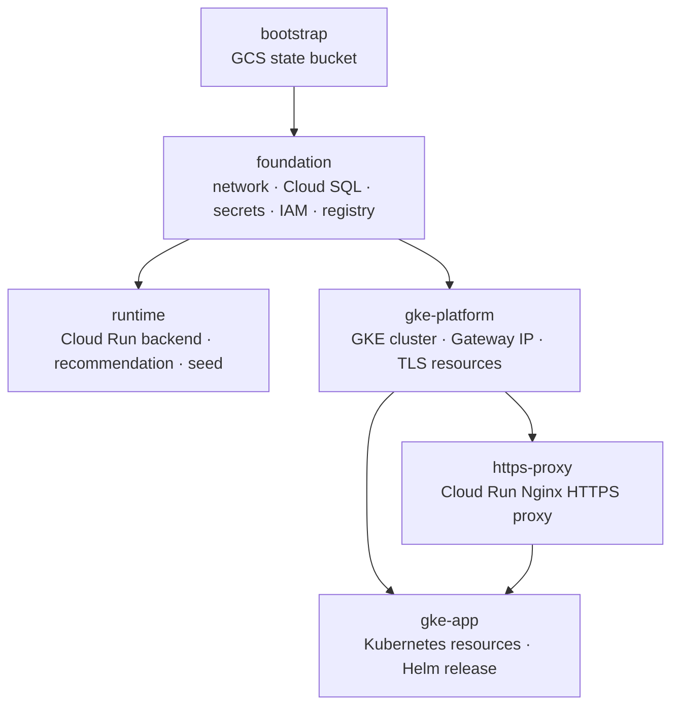

# Các module Terraform của Philobiblus

> Cập nhật: 22/09/2026. Trong tài liệu này, “module” là mỗi thư mục Terraform độc lập trong `infrastructure/terraform/`. Chúng không phải Terraform child module được gọi bằng block `module`; mỗi thư mục có state, lifecycle và lệnh `terraform init/plan/apply` riêng.

## 1. Phân loại

Có hai đường triển khai ứng dụng, cùng dùng một lớp hạ tầng chung:

| Nhóm | Module | Dùng để làm gì |
| --- | --- | --- |
| Hạ tầng chung | `bootstrap` | Tạo GCS bucket lưu Terraform remote state. |
| Hạ tầng chung | `foundation` | Tạo mạng, Cloud SQL, Secret Manager, service account, Artifact Registry và bật API cho cả Cloud Run lẫn GKE. |
| Cloud Run | `runtime` | Chạy trực tiếp backend, recommendation service và seed job trên Cloud Run. |
| Cloud Run, hỗ trợ GKE | `https-proxy` | Chạy Nginx trên Cloud Run để có HTTPS tạm thời, rồi proxy đến Gateway GKE HTTP static IP. |
| GKE/Kubernetes | `gke-platform` | Tạo cụm GKE Autopilot, Gateway static IP và Certificate Manager resources. |
| GKE/Kubernetes | `gke-app` | Dùng Kubernetes + Helm provider để tạo namespace/policy/identity và cài Helm chart Philobiblus vào cụm GKE. |

Vì vậy, câu trả lời là **đúng**: repository có module cho Cloud Run và module cho Kubernetes. `foundation` không thuộc riêng một bên; nó là dependency chung. `https-proxy` là Cloud Run resource nhưng chỉ dùng khi triển khai GKE chưa có custom domain/certificate riêng.



`runtime` và `gke-app` có thể cùng tồn tại trong thời gian migration. Frontend GitHub Pages được chuyển sang GKE chỉ sau khi endpoint GKE đã qua kiểm chứng; Cloud Run runtime vẫn là đường rollback cho đến hết soak period.

## 2. Hạ tầng chung

### `bootstrap/` — Terraform state bucket

| Nội dung | Chi tiết |
| --- | --- |
| Resource chính | `google_storage_bucket.terraform_state` |
| Tạo gì | GCS bucket dùng lưu remote Terraform state. Bucket bật versioning, uniform bucket-level access, public access prevention và lifecycle chỉ giữ 20 version state mới nhất. |
| State của chính nó | Local state lúc bootstrap đầu tiên, vì bucket remote chưa tồn tại. |
| Khi dùng | Chạy đầu tiên một lần cho project/môi trường. |
| Bảo vệ | `prevent_destroy = true`, `force_destroy = false`; không destroy trừ khi thật sự muốn xóa toàn bộ môi trường và lịch sử state. |

Các module còn lại có `backend "gcs"` nhưng chỉ khai báo `prefix`; bucket thật được truyền khi `terraform init -backend-config="bucket=..."`.

### `foundation/` — nền tảng GCP dùng chung

| Nhóm tài nguyên | Resource/chức năng |
| --- | --- |
| Project APIs | Bật Artifact Registry, Certificate Manager, Compute Engine, GKE, IAM, Cloud Run, Secret Manager, Service Networking, Cloud SQL, Logging và Monitoring. `disable_on_destroy = false` nên destroy không tắt API của project. |
| Network | VPC custom, subnet `10.20.0.0/24`, Cloud Router và Cloud NAT. Tên resource mang hậu tố `run` vì ban đầu phục vụ Cloud Run VPC egress, nhưng GKE platform cũng đọc VPC/subnet này từ remote state. |
| Private services | Reserved private range và Service Networking connection để Cloud SQL chỉ có private IP. |
| Image registry | Artifact Registry Docker repository `philobiblus`, có cleanup policy giữ 10 version mới nhất. |
| Identity/IAM | Google service account riêng cho backend, recommendation và seed; backend/seed có `roles/cloudsql.client`. |
| Secrets | Tạo container Secret Manager cho `DATABASE_URL`, JWT và ImgBB API key; cấp quyền đọc tối thiểu theo từng secret cho backend/seed. Giá trị secret được nạp ngoài Terraform bằng script secret, không nằm trong state/config commit. |
| Database | Cloud SQL PostgreSQL 16 private IP, database `philobiblus`, backup/PITR, retention và deletion protection theo `protect_data`. |

**Dependency:** `foundation` cần `bootstrap` bucket để giữ state tại prefix `philobiblus/foundation`. Nó là prerequisite cho `runtime`, `gke-platform` và `gke-app`.

## 3. Nhánh Cloud Run

### `runtime/` — runtime Cloud Run trực tiếp

Đây là module Cloud Run gốc. Nó dùng output mạng, database, secret và service account từ `foundation` remote state.

| Resource | Vai trò |
| --- | --- |
| `google_cloud_run_v2_service.backend` | Public backend API. Dùng service account backend, Cloud SQL volume, secrets và biến `ALLOWED_ORIGINS`. |
| `google_cloud_run_v2_service.recommendation` | Recommendation service chỉ nhận ingress nội bộ. Backend gọi qua URL service này. |
| `google_cloud_run_v2_job.seed` | Seed/migration job có quyền Cloud SQL và dùng backend image. |
| IAM members | Cho phép public invoke backend; recommendation có ingress nội bộ nên không public từ Internet. |

**State:** `philobiblus/runtime`.

**Outputs:** `backend_url`, `recommendation_url`, `seed_job_name`.

**Khi dùng:** đường triển khai Cloud Run độc lập, hoặc giữ làm rollback trong lúc migrate sang GKE. Module này không tạo Kubernetes resource.

### `https-proxy/` — Cloud Run Nginx proxy cho GKE

Module này cũng tạo Cloud Run, nhưng không chạy ứng dụng Python. Nó deploy image Nginx trong thư mục `proxy/`, rồi truyền `BACKEND_UPSTREAM=http://<GKE gateway static IP>` qua environment variable.

| Resource | Vai trò |
| --- | --- |
| `google_cloud_run_v2_service.proxy` | Cloud Run public Nginx. Cloud Run cấp URL HTTPS `*.run.app`; Nginx forward request đến GKE Gateway. |
| `google_cloud_run_v2_service_iam_member.public` | Cho phép Internet gọi proxy. |
| `data.terraform_remote_state.platform` | Đọc `gateway_ip_address` từ `gke-platform`; vì vậy proxy không thể chạy trước GKE platform. |

**State:** `philobiblus/https-proxy`.

**Outputs:** `proxy_url`, `api_url` (đúng giá trị đưa vào `VITE_API_URL`) và `upstream_gateway_ip`.

**Khi dùng:** chỉ là phương án chuyển tiếp khi GitHub Pages cần HTTPS nhưng chưa có custom domain để gắn Google-managed certificate trực tiếp vào Gateway. Khi domain + Certificate Manager đã hoạt động, frontend gọi `https://api.<domain>/api` và module này có thể destroy riêng bằng `scripts/k8s-terraform/36-proxy-destroy.sh`.

## 4. Nhánh GKE/Kubernetes

### `gke-platform/` — GKE platform và public edge

Module này dùng Google provider và đọc VPC/subnet từ `foundation`. Nó không dùng Kubernetes provider, nên cluster được tạo hoàn chỉnh trước khi Terraform cố kết nối Kubernetes API.

| Resource | Vai trò |
| --- | --- |
| `google_container_cluster.main` | GKE Autopilot regional cluster: VPC-native, private nodes, Gateway API, Secret Manager add-on/sync, Managed Prometheus, Cloud Logging/Monitoring, security posture và maintenance window. |
| `google_compute_global_address.gateway` | Static global external IPv4 mà Gateway Kubernetes tham chiếu bằng `NamedAddress`. DNS không được trỏ vào ephemeral IP. |
| `google_certificate_manager_dns_authorization.api` | Chỉ tạo khi `enable_gateway_https=true` và có `api_hostname`; xuất CNAME cần thêm vào DNS. |
| `google_certificate_manager_certificate.api` | Google-managed certificate cho hostname API. |
| `google_certificate_manager_certificate_map.api` và entry | Map certificate theo hostname để GKE global Gateway gắn qua annotation `networking.gke.io/certmap`. |

**State:** `philobiblus/gke-platform`.

**Outputs chính:** cluster name/location/endpoint/CA, gateway address name/IP, hostname và Certificate Manager names/DNS authorization record.

**Khi dùng:** apply trước `gke-app`. Nếu bật HTTPS custom domain, apply module này trước để lấy DNS authorization, chờ certificate `ACTIVE`, rồi mới attach certificate map qua Helm/Gateway trong `gke-app`.

### `gke-app/` — Kubernetes resources và Helm release

Module này là phần “Kubernetes Terraform” đúng nghĩa. Nó dùng đồng thời Google, Kubernetes và Helm provider. Kubernetes/Helm provider lấy endpoint, CA và access token từ `gke-platform` remote state; do đó không apply khi cluster chưa `RUNNING`.

| Resource | Vai trò |
| --- | --- |
| Namespace, ResourceQuota, LimitRange | Tạo namespace `philobiblus`, giới hạn quota/request mặc định. |
| Kubernetes service accounts | Service account riêng cho backend, recommendation, seed. |
| Workload Identity bindings | Gắn KSA backend/seed với GSA từ `foundation`, để Pod đọc secret/call Cloud SQL mà không dùng service-account key. |
| `helm_release.philobiblus` | Cài chart tại `kubernetes/helm/philobiblus`: backend/recommendation Deployments, Services, seed Job, HPA, Gateway/HTTPRoute, Secret Manager sync, PodMonitoring và policy/chart resources. Frontend/PostgreSQL in-cluster tắt trong cấu hình GKE vì GitHub Pages và Cloud SQL thay thế chúng. |

**State:** `philobiblus/gke-app`.

**Outputs:** namespace, Helm release name, Gateway IP và HTTP backend URL dùng để kiểm tra trước khi có HTTPS domain.

**Khi dùng:** apply sau `gke-platform`, kubeconfig/access token sẵn sàng và application secrets đã có version enabled trong Secret Manager.

## 5. Thứ tự triển khai và destroy

### Triển khai từ đầu

```text
bootstrap
   -> foundation
      -> runtime                         (nếu chọn Cloud Run trực tiếp)
      -> gke-platform -> gke-app         (nếu chọn GKE)
                              -> https-proxy (tùy chọn, HTTPS tạm thời cho GKE)
```

Không cần apply `runtime` để GKE chạy. Trong migration, apply cả hai để Cloud Run còn làm rollback. `https-proxy` phụ thuộc GKE platform/Gateway, nhưng không phụ thuộc `gke-app` ở cấp Terraform state; trên thực tế chỉ deploy nó sau khi Gateway/backend GKE đã healthy.

### Destroy an toàn

```text
https-proxy -> gke-app -> gke-platform -> runtime -> foundation -> bootstrap
```

Thứ tự thực tế tùy môi trường: không destroy `runtime` khi GitHub Pages vẫn rollback qua Cloud Run; không destroy `foundation` khi Cloud SQL/data, secrets, registry hoặc GKE còn cần nó; không destroy `bootstrap` cho đến khi toàn bộ remote state đã không còn cần bucket.

## 6. File cấu hình và state không được commit

Mỗi module có `terraform.tfvars.example` chứa placeholder. Tạo file `terraform.tfvars` thật ở local hoặc để scripts tạo trong `scripts/k8s-terraform/.local`; không stage các file này. Không commit:

- `terraform.tfvars`, `*.auto.tfvars` thật, `.tfplan` và `.terraform/`;
- remote state GCS/local state;
- database URL/password, JWT, ImgBB key, access token, kubeconfig hoặc DNS/registry token.

Nạp secret value sau `foundation` bằng `scripts/terraform-secrets-apply.sh`; Terraform chỉ quản lý Secret Manager resource và IAM, không quản lý secret value.

## 7. Bản đồ scripts

| Mục tiêu | Script chính |
| --- | --- |
| Bootstrap + foundation | `scripts/terraform-apply.sh` |
| Destroy foundation/bootstrap có guard | `scripts/terraform-delete.sh` |
| Cloud Run runtime | `scripts/terraform-runtime-apply.sh`, `scripts/terraform-runtime-delete.sh` |
| GKE platform và application | `scripts/k8s-terraform/deploy.sh`, hoặc các bước `15-platform-plan.sh` → `20-platform-apply.sh` → `25-kubeconfig.sh` → `27-core-secrets.sh` → `30-app-apply.sh` |
| Cloud Run HTTPS proxy cho GKE | `scripts/k8s-terraform/35-proxy-apply.sh`, `36-proxy-destroy.sh` |
| Liệt kê state Cloud Run cũ | `scripts/terraform-managed-resources.sh` (hiện chỉ đọc bootstrap/foundation/runtime; không phải inventory đầy đủ cho GKE modules) |

Xem [GKE_DEPLOYMENT_PLAN.md](GKE_DEPLOYMENT_PLAN.md) cho lộ trình GKE và [GKE_PHASE_7_HTTPS_DOMAIN_RUNBOOK.md](GKE_PHASE_7_HTTPS_DOMAIN_RUNBOOK.md) cho custom domain/HTTPS chính thức.
